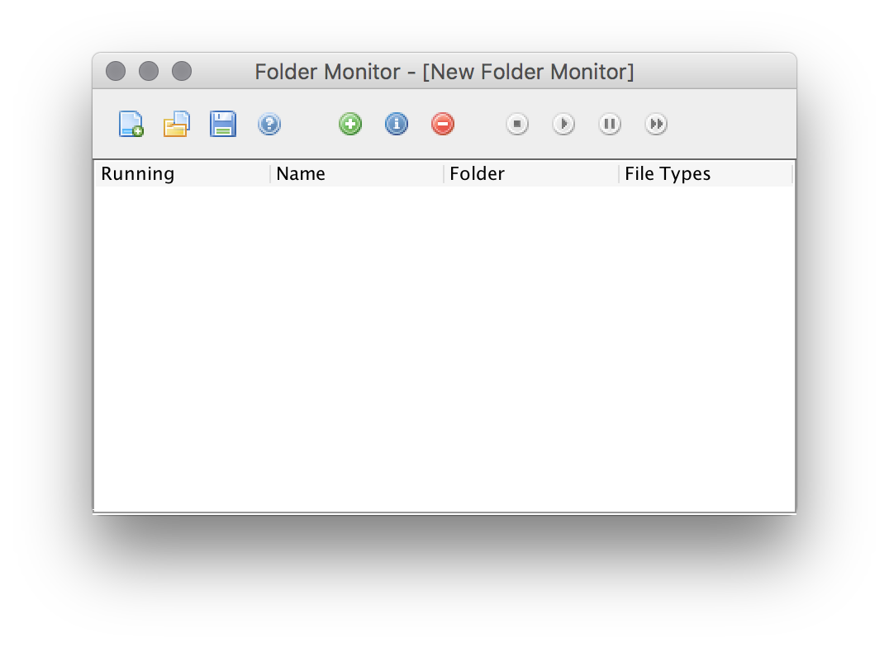
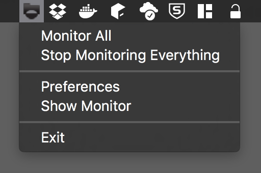
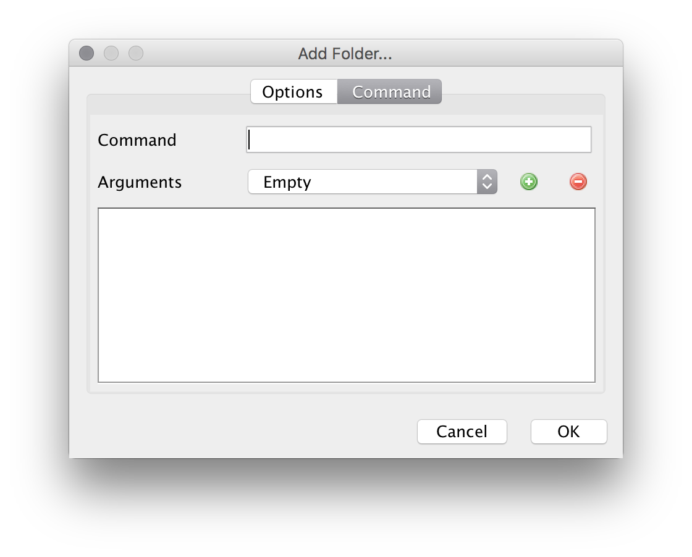

Folder Monitor is an open source java application that monitors a folder 
for a specified file type and runs a command on that file.

This project had 2 major goals:

## Java Integration with OSX

I wanted to see how tightly integrated a java application could be with OSX.

The OSX theme swing theme that comes with java it pretty close to looking native.
The menus integrated without issue and the app bundled nicely in a .app package.

## Run Based on File

I wanted an app that could watch a dropbox or a sync service folder, see a file and do something with it.
For example:
* Perhaps I dropped an image into a folder on dropbox, once that image is sync'd, folder monitor would import
that image into my photo library.
* May a file with the extension, .restart gets dropped into a folder, then a command to restart the computer would run.

## Support

This app is gifted as is. Won't be making any updates.